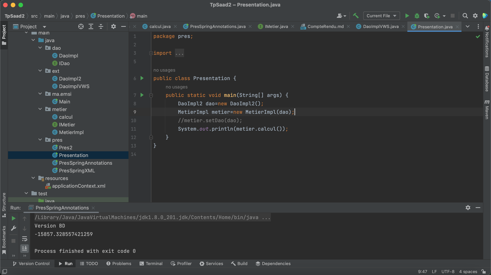

# tp1
<H1 align="center">Compte Rendu TP1</H1>

 Travail a faire, sur l'injection des dépendances

<h2>Package IDao</h2>
<h3>Interface IDao</h3>

<h3>Classe qui implement la'interface IDao</h3>

<h2>Package extensions</h2>
<h3>Capteur version</h3>

<h3>web service  version</h3>

<h2>Package Imetier</h2>
<h3>Interface Imetier</h3>

<h3>Classe qui implement l'interface Imetier</h3>

<h3>classe calcul pour faire un test unitair </h3>

<h2>Package Presentation</h2>
<h3>Static version</h3>

<h3>dynamique version </h3>

<h3> Spring Annotation version</h3>

<h3>Spring XML version</h3>

<h3>Fichier de Config</h3>

